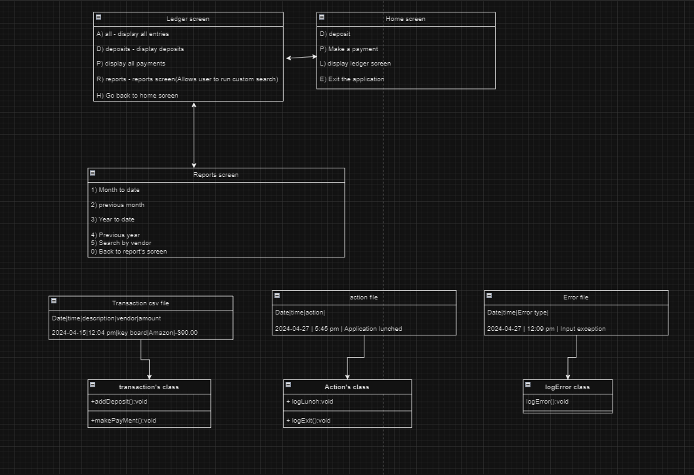
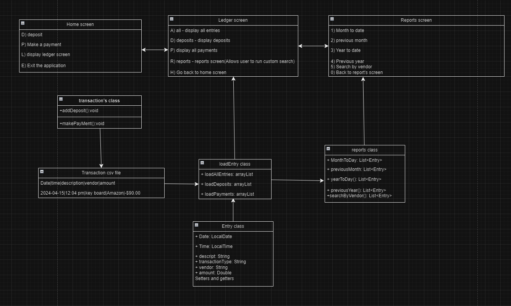

# capstone-1
### Project overview
I created a account ledger project that will allow the user to make a deposit, and make a transaction. The user will also be able to display all deposits, transaction, and search through the reports with filters. 

This is how i started planning out my project



This is how I ended



## home screen
I started off by making my home screen and prompting the user to make a deposit, make a payment, display Ledger screen, or Exit to exit the application

* Make deposit

When the user chooses to make a deposit the program will prompt the user to enter the description of the deposit, the vendor, and the deposit amount. When the user enter's all that information it log the deposit with the date and time plus the info to a csv file.

Code used to add the deposit functionalty:

```java
public void logDeposit()
    {
        LocalDate date = LocalDate.now();
        LocalTime time = LocalTime.now();

        // checking if file exists if it doesn't then we create it
        File directory = new File(LOG_DIRECTORY);
        if (!directory.exists())
        {
            directory.mkdir();
        }

        File transactionLogs = new File(LOG_DIRECTORY + "\\"  + FILE_NAME);

        try(
                FileWriter fileWriter = new FileWriter(transactionLogs, true);
                PrintWriter writer = new PrintWriter(fileWriter);
        )
        {
            // logging the deposit info to the transaction file with date and time
            writer.printf(" %s | %s | %s | %s | $%.2f \n", date.format(DATE_FORMAT), time.format(TIME_FORMAT), depositDescription, vendor, amount);
            System.out.println();
            System.out.printf("$%.2f deposit from %s ", amount, vendor);
            System.out.println();
        }
        catch (IOException e)
        {
            System.out.println("File does not exist");
        }
        catch (Exception e)
        {
            System.out.println("Something went wrong");
            e.printStackTrace();
        }

    }
```

* Make a payment

When the user chooses to make a payment. The user will be prompted for payment description, vendor, and amount. Once the user provides the information needed to make the payment it will get saved in the transaction file.

Code for logging the payment: 
```java
public void logPayment()
    {
        transActionType = "withdrawal";

        LocalDate date = LocalDate.now();
        LocalTime time = LocalTime.now();

        File transactionLogs = new File(LOG_DIRECTORY + "\\"  + FILE_NAME);

        try(
                FileWriter fileWriter = new FileWriter(transactionLogs, true);
                PrintWriter writer = new PrintWriter(fileWriter);
        )
        {
            // logging the deposit info to the transaction file with date and time
            writer.printf(" %s | %s | %s | %s | %s | $%.2f \n", date.format(DATE_FORMAT), time.format(TIME_FORMAT),transActionType , Description, vendor, amount);

            System.out.println();
            System.out.printf("$%.2f payment to %s ", amount, vendor);
            System.out.println();
        }
        catch (IOException e)
        {
            System.out.println("File does not exist");
        }
        catch (Exception e)
        {
            System.out.println("Something went wrong");
            e.printStackTrace();
        }
    }
```

## Ledger Screen

When the user click's on the ledger screen the program is going to prompt the for "A" to display all entries. "D" to display all deposit's, "P" to display all payment's, and "R" to go to the report's screen.

* "A") When the user prompt's for "A" all the transaction's in the csv file will be in arrayList of object's, then get displayed to the screen. 

* "D") When the user enters "D" the method loadAllDeposits() in the loadEntries class with will read from the transaction file and check if the transaction type is a deposit. If it is a deposit it will then get added to an arrayList of object. Then get's returned and display's all the deposits to the screen.  

* "P") When the user enter's "P" the method loadAllPayments in the loadEntries class will read the transaction file and check if the entry type is a Withdrawal if it is, it will be added to a arrayList of objects and returned. Then it will be displayed in the console after we loop through the array list that got returned.

* "R") when the user enter "R" the user will be taken to the report's screen. 

* "H") when the user enters "H", the user will be taken back to the home screen.

## Report's Screen

1) Month to day reports. When the user enter's "1" for month to day. The application will display all the reports from the current month first day until the current date ex: 2024-04-01 - 2024-04-30. I accomplished this functionalty by getting the current date and the current's date first day of the month. Then I looped through all the report's and checked if the report's date is not before the first day of the month and is not after the current day and added it to an array list.

2) Previous Month reports. When the user enter's "2" it will display the previous month reports. First I got the previous month's first day and the previous months last day. Then looped through the transaction's and checked if the transaction date is not before the previous months first and is not after the previous month last day. Then added the results into a list and displayed them on the console.

3) Year to date reports. When the user clicks "3" it will display all the reports from the begining of the year until the current date. First i got the first day and month of the current year and the current date. Then I looped through the reports and checked if the reports date is before the begining of the year and is not after the current date. I added the results to a list, then displayed it on the console.

4) Previous year reports. When the user clicks "4" it will display all the reports from the previous year. First I got the first day of the previous year and the last day of the previous year. Then I looped throught reports and checked if reports date is before the previous year's first day and is not after the previous year's last day. I added the results to a list and then displayed it in the console.

5) Search by vendor. When the user enters "5" the user will be prompted to enter the vendors name. The name will get passed to the searchByVendor() method in my reports class. It will loop through all the transaction and check if the vendor's name is equal to the user input. Then it will add it to a list then display's it to the screen.

## Struggles

I was struggling on filtering the data and couldn't come up with the solution for it. Then i did some research on the date class and learned that there is a isBefore and isAfter methods. I realized I needed the current date and the first day of the current month. What i did is loop through the transactions and checked if transaction date is not before the first day of the month and is not after the last day of the month. Once I figured this problem out, I got a clear understanding of it and it made all the other filters easier. 

Code for Month to date search: 
```java
public List<Entry> getMonthToDate()
    {
        LocalDate currentDate = LocalDate.now();
        LocalDate firstDayOfTheMonth = currentDate.withDayOfMonth(1);
        LoadEntries loadEntries = new LoadEntries();
        ArrayList<Entry> allTransactions = loadEntries.loadAllEntries(); //<==getting all the entries

        /* filtering through the reports and checking if a reports date is not before the first day of the month
        and also checking its not after the current date then adding it to the list  */
        System.out.println();
        System.out.println("Report's from: " + firstDayOfTheMonth + " - " + currentDate);
        List<Entry> monthToDay = allTransactions.stream()
                .filter(report -> !report.getDate().isBefore(firstDayOfTheMonth))
                .filter(report -> !report.getDate().isAfter(currentDate))
                .toList();

        return monthToDay;
    }
```

Code for previous month search:

```java
public List<Entry> getPreviousMonth()
    {
        LoadEntries loadEntries = new LoadEntries();
        ArrayList<Entry> allTransactions = loadEntries.loadAllEntries(); //<== getting all the entries
        LocalDate currentDate = LocalDate.now();

        /* getting the first day of the previous month by substring one month from current month and getting the
        * first day of that month*/
        LocalDate firstDayOfPreviousMonth = currentDate.minusMonths(1).withDayOfMonth(1);

        /* getting the last day of the previous month by adding one month to the firstDayOfThePreviousMonth and subtracting one day so that it d
        * doesn't go to the current month
        * */
        LocalDate lastDayOfPreviousMonth = firstDayOfPreviousMonth.plusMonths(1).minusDays(1);

        /*
        * getting previous month's transAction by streaming and filtering through the report arrayList and checking if
        * the reports is not before the first day of the previous month and is not after the last day of the previous month
        * */

        System.out.println();
        System.out.println("Report's from: " + firstDayOfPreviousMonth + " - " + lastDayOfPreviousMonth);
        List<Entry> previousMonthReports = allTransactions.stream()
                .filter(prevMonthReports -> !prevMonthReports.getDate().isBefore(firstDayOfPreviousMonth))
                .filter(prevMonthReports -> !prevMonthReports.getDate().isAfter(lastDayOfPreviousMonth))
                .toList();

        return previousMonthReports;
    }
```